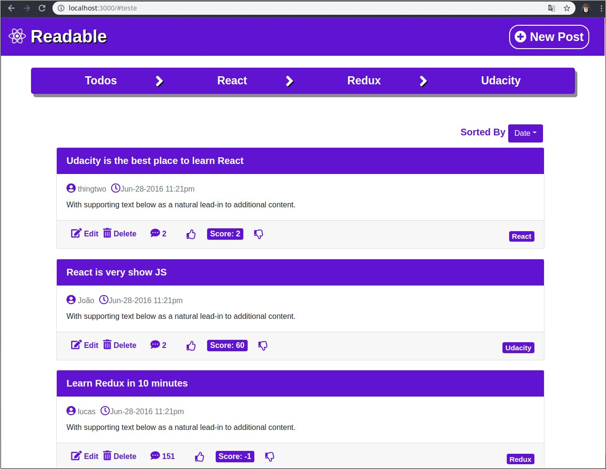

Este projeto foi criado com o [Create React App](https://github.com/facebook/create-react-app).

## Importante !

Você precisará executar o servidor, que está disponível na pasta server do projeto.

## Manual de Instalação

Na diretorio do projeto execute:  
`npm install` para instalar as dependencias    

`npm start` para executar a aplicação 

Por padrão a aplicação vai abrir na seguinte URL [http://localhost:3000](http://localhost:3000), copie e cole essa URL no seu Browser de preferencia.

## Sobre o Projeto

O projeto Readable é um projeto solicitado no segundo modulo do nanodegree de desenvolvimento em React, o modulo de Gerenciamento de estados com Redux

 Tecnologias Utilizadas no Projeto. 

<ul>
  <li>React</li>
  <li>Redux</li>
  <li>Bootstrap</li>
</ul>

<b>Projeto Readable </b>

  

  

 Você pode ler mais sobre o create react app em  [Create React App documentation](https://facebook.github.io/create-react-app/docs/getting-started).

Documentação do React   [React documentation](https://reactjs.org/).

